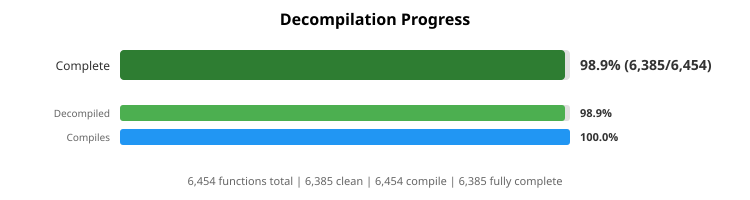
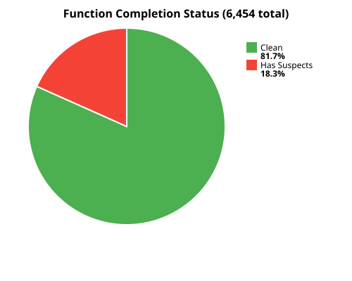
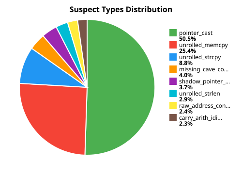
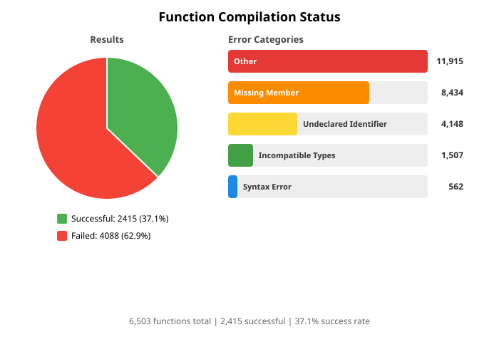

# NocturneDecomp

A work-in-progress reverse engineering and decompilation project for the game **Nocturne**, aimed at understanding its game engine architecture and implementation.

## About

This project uses [Ghidra](https://ghidra-sre.org/) to decompile and analyze the Nocturne game binary. The goal is to document and understand the inner workings of the Nocturne game engine through systematic reverse engineering efforts.

**Status:** Active Research - This is an ongoing research project with continuous updates as new discoveries are made.

## Progress



*"Complete" = function has clean decompilation (no suspect patterns) AND compiles successfully with clang++.*

### Decompilation Details

| Status | Breakdown |
|:------:|:---------:|
| [](annotations/nocedit.exe/reports/all_files_decompilation.svg) | [](annotations/nocedit.exe/reports/all_files_decompilation.svg) |

*Click charts to see per-file breakdown. "Clean" = no decompiler artifacts (extraout_, unaff_, BADSPACEBASE, etc.).*

### Compilation Details

[](annotations/nocedit.exe/reports/all_files_compilation.svg)

*Click chart to see per-file breakdown. Compiled with clang++ -m32 -fsyntax-only.*

## Project Structure

### `/annotations`
Exported Ghidra annotations for `nocedit.exe` (Nocturne's level editor) in JSON format. Includes data types, symbol namespaces, external imports, and applied structure definitions from the current analysis.

### `/headers`
Watcom C/C++ 11.0 compiler standard library headers. These headers are used to properly identify and type standard library functions and structures that the game was compiled against.

### `/historical_annotations`
Archived snapshots of previous annotation exports. Preserves earlier analysis states for comparison and tracking the evolution of reverse engineering progress.

### `/prompts`
AI/LLM prompt templates for assisted reverse engineering. Includes prompts for disassembly analysis, code generation, and maintaining coding standards during the decompilation process.

### `/research`
Technical research documentation. See **[research/README.md](research/README.md)** for full index.

| Folder | Description |
|--------|-------------|
| `01-file_structure/` | Class hierarchy and source file mapping |
| `02-mrgl_initial_investigation/` | MRGL 3D rendering system analysis |
| `03-rendering_primitives/` | Primitive formats and rendering pipeline |
| `04-mp3_audio_system/` | MP3 decoder and DirectSound integration |
| `05-badspacebase_investigation/` | Ghidra decompiler fixes for Watcom code |
| `06-per_function_decompiler_helpers/` | Per-function decompiler control system |

### `/scripts`
Python automation scripts for Ghidra (PyGhidra headless):
- Annotation import/export and synchronization
- Pseudocode export with suspect pattern detection
- Analysis report generation (text reports, CSVs, SVG graphs)
- Hidden function discovery
- String creation utilities
- Custom helper libraries for annotation management

### `/spec`
Custom Ghidra processor specifications for the x86 Watcom compiler. Includes language definitions (.ldefs), calling convention specifications (.cspec), and pattern matching for Watcom C++ compiled code.

## Building

The repository ships a CMake project that drives two pipelines from the exported
pseudocode — see [`cmake/README.md`](cmake/README.md) for the full reference.

**Prerequisites:** `cmake ≥ 3.20`, `clang`/`clang++` with 32-bit support, `python3`, `ninja`.

```sh
# Syntax-only verification (reproduces the 100% clang++ milestone)
cmake --preset check-linux
cmake --build --preset check-linux

# Full executable build (32-bit Linux ELF)
cmake --preset exe-linux
cmake --build --preset exe-linux
```

Per-function source selection priority:
`.keep.{cpp,c}` > `.mmx.{cpp,c}` / `.byval.{cpp,c}` > raw `.cpp`/`.c`.
The decompiled `entry/` and `crt/` directories are excluded from the exe build —
`src/main/main.cpp` provides the entry point and linking uses the system
C/C++ runtime bridged through `shims/`.

## Contributing

This is a research project. If you're interested in contributing or have insights about the Nocturne engine, contributions and documentation improvements are welcome.

## Legal Notice

This project is for educational and research purposes only. All reverse engineering is conducted in accordance with applicable laws. This repository contains only reverse-engineered documentation, annotations, and analysis derived from the decompilation process. No original game binaries, assets, or copyrighted materials from the game are included in this repository.

## Tools Used

- **Ghidra** - Primary decompilation and reverse engineering tool
- Additional analysis tools as needed for specific research tasks
